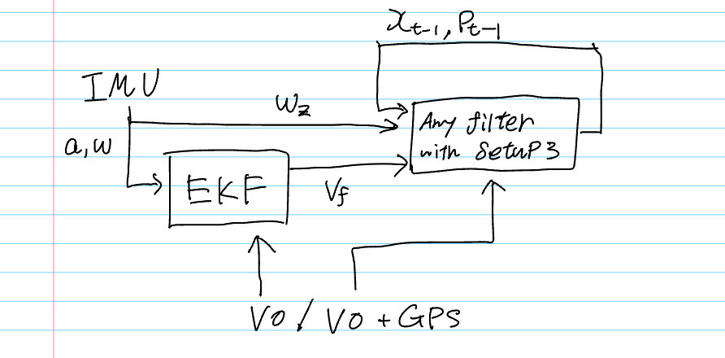

## Description

The `wrapper` folder contains a python script that wraps implemented filters and run the filter based on different filter architecture.

The detailed explanation is given below.

In the notebook, named `notebooks/KITTI/experiments/tests/Madgwick_and_calculated_angular_velocity_comparison.ipynb`, shows that estimated euler angle is almost similar to the angles provided by OXTS. With regard to the forward velocity, our estimation is shows relatively close to the forward velocity provided by OXTS, which is assumed to be obtained by combination of GPS displacement and some kind of filter to smooth the values as shown in the notebook named `notebooks/KITTI/experiments/tests/gps_displacement_vs_forward_velocity_comparison_test.ipynb`.

Now, we have three setups, Setup1(IMU, VO), Setup2(IMU, VO+GPS), Setup3(INS(forward velocity), VO+GPS) and we agreed upon that Setup3 has a robust estimation than the other setups in terms of overall experiments and the IMU-only filter experiment located under `notebooks/KITTI/experiments/tests/` folder.

Hence, it is worth trying to implement Setup3, which uses velocity motion model that assumes that pose of a grounded vehicle can be explained by linear forward velocity and angular velocity.

The implementation is shown in the figure below:

As shown in the figure, there are two filters connected sequentially. The first filter, EKF, introduces Setup1 motion model that uses IMU's linear acceleration and angular velocity to estimate state of the system. In the measurement update step in the EKF, it takes VO to correct position and velocity, which is obtained by displacement / delta time. After correction step, the forward velocity from the EKF and z-axis angular velocity are fed to the second filter to propagate the state based on the velocity motion model in Setup3, then the state is corrected by either VO or VO+GPS.

